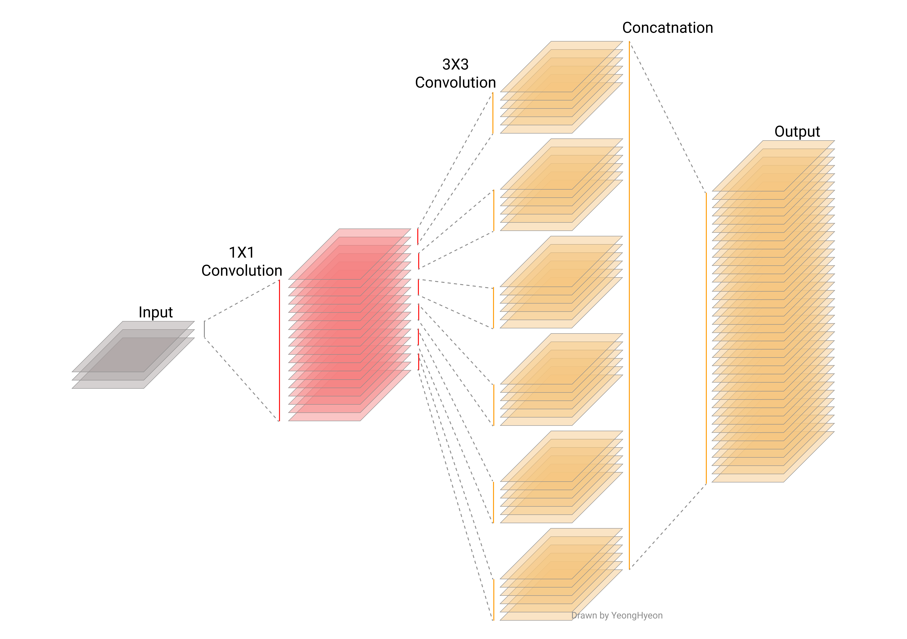

[TensorFlow 2] Xception: Deep Learning with Depthwise Separable Convolutions
=====
TensorFlow implementation of "Xception: Deep Learning with Depthwise Separable Convolutions"

## Related Repositories
<a href="https://github.com/YeongHyeon/Inception_Simplified-TF2">Inception_Simplified-TF2</a>  

## Concept
<div align="center">
    
  <p>The Xception module comparing with the Inception module [1].</p>
</div>

<div align="center">
  
    
  <p>Comparing the Inception and the Xception module via 3D view.</p>
</div>

## Performance

|Indicator|Value|
|:---|:---:|
|Accuracy|0.-----|
|Precision|0.-----|
|Recall|0.-----|
|F1-Score|0.-----|

```
Confusion Matrix
```

## Requirements
* Python 3.7.6  
* Tensorflow 2.1.0  
* Numpy 1.18.1  
* Matplotlib 3.1.3  

## Reference
[1] François Chollet (2016). <a href="https://arxiv.org/abs/1610.02357">Xception: Deep Learning with Depthwise Separable Convolutions</a>. arXiv preprint arXiv:1610.02357.
